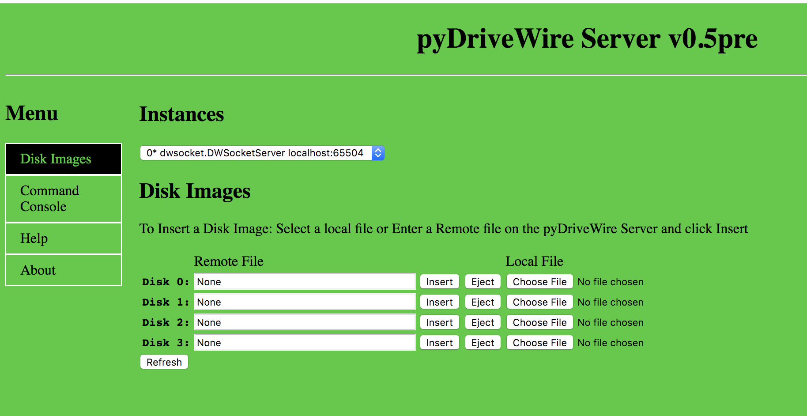
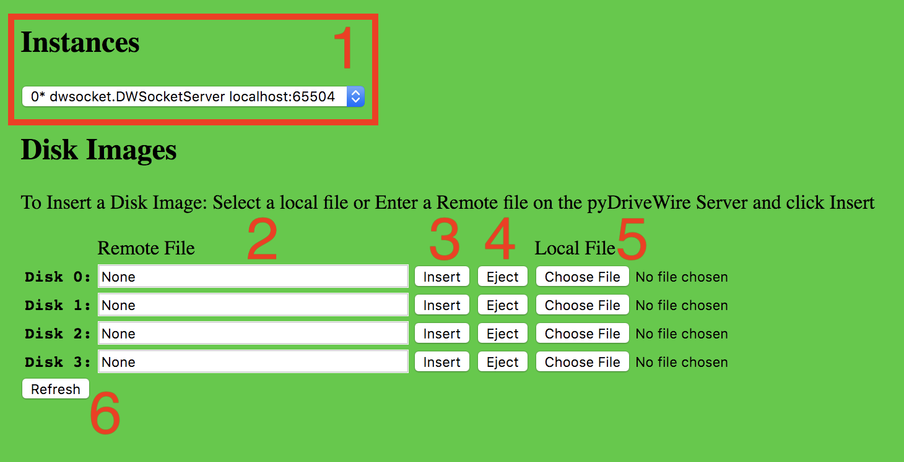
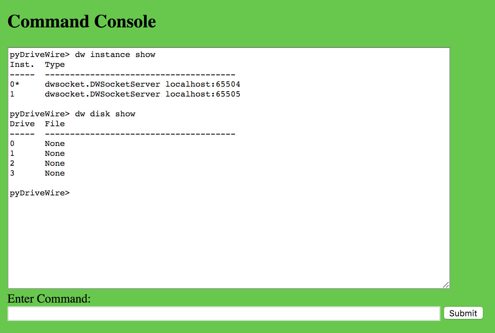

# The pyDriveWire Manual v0.5d

Python Implementation of DriveWire 4 and EmCee Protocols

PyDriveWire is a nearly complete DriveWire4 Server written in Python.  The goal is to eventually implement all of the features available.  The server also implements additional features that are not available in DriveWire4.

PyDriveWire also has support for the EmCee Protocol for use with MCX Basic on the TRS-80 MC-10.  

DriveWire 4 and EmCee Procotols can be used simultaneously on the server without reconfiguration.

# Table of Contents

1. [Features](#ch1)
2. [Getting Started](#ch2)
3. [Command Line and Config File Options](#ch3)
4. [Web User Interface](#ch4)
5. [Command Console Interfaces](#ch5)
6. [Using a Config File](#ch6)
7. [Multiple Instances](#ch7)
8. [Daemon Mode](#ch8)
9. [EmCee Server](#ch9)
10. [Experimental Printing Support](#ch10)
11. [Experimental SSH Support](#ch_ssh)
12. [Debugging](#ch11)
13. [HDB-DOS Mode](#ch12)
14. [Appendix: Supported DriveWire Commands](#ch13)
15. [NEW: Directories](#ch_directories)
16. [NEW: Aliases](#ch_aliases)
17. [NEW: DLOAD Protocol Support](#ch_dload)
18. [NEW: Named Object Support](#ch_namedobj)
19. [NEW: Dragon DosPlus Extender Support](#ch_dragon)
20. [NEW: DriveWire Virtual Modem for TCP, Telnet, and SSH](#ch_vport)

# 1. Features

* (new for v0.5c) [New Easy Installation Methods: Binary Package, Docker](#ch2)
* (new for v0.5c) `dw config show` command
* (new for v0.5c) `dw config save` command
* (new for v0.5c) `dw disk create` command
* (new for v0.5c) Major re-work of Virtual Serial Channels
* (new for v0.5c) [Printing Support Enhancements](#ch10)
* [Web User Interface](#ch4) (`--ui-port`)
* [Configuration File support](#ch6)
* [Multiple Instance Support](#ch7) — Requires config file
* [Daemon Mode](#ch8) - Linux/macOS Only - Requires config file
* [Enhanced `pyDwCli` command console tool](#ch5)
* [Comprehensive and detailed manual for server features](#toc)
* [Printing: EmCee/MCX-Basic Printing Support](#ch10)
* [HDB-DOS Mode and Disk image offset](#ch12)
* Remote dw command input on TCP port
* [EmCee Protocol Support](#ch9)
* Supported on Linux, macOS, and Windows
* `dw server dir` and `dw server list` enhanced to run on _ALL_ OSes (Mac/Windows/Linux, etc)
* [Experimental printing support prints to PDF or text file](#ch10)
* Connections to serial ports at all supported baud rates: 38400, 57600, 115200, 230400, 460800, 921600
* Listen for incoming connection on any TCP port with a default of 65504
* Ability to make outgoing TCP connections for serial-net converters
* Disks to be mounted can be specified on the command line
* Interactive CLI allowing all dw commands to be run
* Support for DriveWire 4 virtual ports
   * `dw` commmands over vport
   * `AT` Modem-style connections
   * Outbound connections with `ATD`/`ATDT` or `tcp connect`
   * Inbound vports via `tcp listen/join/kill` commands

## Notable Missing Features
* MIDI
* OS9 `/Z` console windows
* MShell Support

[Back to top](#toc)

# 2. Getting Started

(new for v0.5c) pyDriveWire has two Easy Installtion Methods: Binary Package and Docker.  These options are designed for Ease Of Use and do not require a complex series of installation steps.   pyDriveWire can also be run directly from any `pypy` or `python` install if it meets the appropriate requirements.

In terms of performance, the Python and Binary Package installation methods are fully functional but have the lowest performance.  Docker provides a medium level of performance.  pypy should be used to get the maximum performance out of pyDriveWire.

## 2.1 Binary Package Installation
Binary packages are available at the following location:

[https://github.com/n6il/pyDriveWire/releases/latest](https://github.com/n6il/pyDriveWire/releases/latest)

Packages are available for the following operating systems:

* `linux-x86_64` -- Any modern 64-bit Linux 
* `win-x64` -- 64-bit Windows (Windows 7 or later)
* `win32` -- 32-bit Windows (Windows 7 or later)
*  `rpi3` -- Raspberry Pi 3 (Raspbian Buster)
*  `rpi4` -- Raspberry Pi 4 (Raspbian Jesse)
*  `macOs` -- macOs (High Sierra or later)

Using a Binary Package is very simple:

1. Download the package for your operating system
2. Unzip the package
3. The package contains two executable programs `pyDriveWire` and `pyDwCli` and a copy of this manual.
4. Run the `pyDriveWire` executable.  See next section for examples:
5. Full details of the command line options are in the [Command Line and Config File Options](#ch3) section.

## 2.2 Running a Binary Package
Example: Run pyDriveWire with the HTTP UI on port 6800 and use a serial port:

    pyDriveWire --ui-port 6800 --port /dev/ttyUSB0 --speed 460800
    
Example: Run pyDriveWire with the HTTP UI on port 6800 and use a serial port and mount two disk images:

    pyDriveWire --ui-port 6800 --port /dev/ttyUSB0 --speed 460800 \
    	/demo/test1.dsk /demo/test2.dsk

Example: Run pyDriveWire with the HTTP UI on port 6800 and the Becker port connection on port 65504:

    pyDriveWire --ui-port 6800 --accept --port 65504

## 2.3 Docker
1. Install Docker Desktop
2. Clone the container: `docker pull mikeyn6il/pydrivewire`
3. Run the container.  See next section for examples.  
4. Full details of the command line options are in the [Command Line and Config File Options](#ch3) section.

## 2.4 Running The Docker Container
Example: Run pyDriveWire with the HTTP UI on port 6800 and use a serial port:

    docker run -i -p 6800:6800/tcp -p 65504:65504/tcp \
    	--device /dev/ttyUSB0:/dev/ttyUSB0 mikeyn6il/pydrivewire:latest \
    	--ui-port 6800 --port /dev/ttyUSB0 --speed 460800

For Windows use the following `--device` option:

    --device COM4:/dev/ttyUSB0

Example: Run pyDriveWire with the HTTP UI on port 6800 and use a serial port and use a HTTP disk image:

    docker run -i -p 6800:6800/tcp -p 65504:65504/tcp \
    	--device /dev/ttyUSB0:/dev/ttyUSB0 mikeyn6il/pydrivewire:latest \
    	--ui-port 6800 --port /dev/ttyUSB0 --speed 460800 \
    	http://www.ocs.net/~n6il/DWTERM.dsk

Example: Run pyDriveWire with the HTTP UI on port 6800 and the Becker port connection on port 65504:

    docker run -i -p 6800:6800/tcp -p 65504:65504/tcp \
    	mikeyn6il:pydrivewire/latest \
    	--ui-port 6800 --accept --port 65504

 
## 2.4 Installation Requirements

* pypy -- For maximum performance it is recommended to run the server with
pypy.  pypy is a Python interpreter that does JIT compilation and results in
greatly increased speed
* pyserial -- Install using pip

## 2.5 Supported Operating Systems
* Any OS where you can run Python, including but not limited to:
* Linux
* macOS
* Windows

## 2.6 Installation (Linux/macOS/UNIX)
* Download Latest: [https://github.com/n6il/pyDriveWire/releases](https://github.com/n6il/pyDriveWire/releases)
* Mac: `brew install pypy; pypy -m pip install pyserial`
* Ubuntu: `apt-get install pypy; pypy -m pip install pyserial`

_Experimental Printing Support_

* `pypy -m pip install reportlab`

## 2.7 Installation (Windows)

There are multiple ways to get Python and pyDriveWire installed on Windows.
As long as the basic requirements are met you can use any method to install
PyPy or Python.  The requirements and two fully-tested example installation
workflows are below.

### Requirements

* pyDriveWire is a Python 2.7 script.  It may or may not run on Python3
  (will likely migrate at a later time). 
* PyPy is preferred over CPython.  Pypy has Just-In-Time compilation and
  pyDriveWire will run a lot faster (and likely will also use lower CPU)
than CPython, but pyDriveWire is completely compatible with either one.
* Use the latest version of  _Python 2.7 Compatible PyPy for Windows_ or
  Python 2.7.X
* PyPy or Python should be installed in the system PATH
* PIP is required for installing required python modules
* PySerial module (use pip to install)
* Experimental Printing Support requires the ReportLab module (use pip to
  install)

### Bleeding Edge/Experimental/Pre-Release Features

The instructions below direct you to install the latest _stable release_
from the GitHub releases page.  If you would like to try out or help to
test the latest pyDriveWire code you can obtain pyDriveWire from it's
`develop` branch.  You can download a static zip file from GitHub or clone
the repository and switch to the `develop` branch.

We're more than happy to accept merge requests or bug reports for any
version you are trying.

### pyDriveWire Windows Installation Instructions (pypy)

1. Obtain the latest copy of _Python 2.7 Compatible PyPy for Windows_  from
   https://www.pypy.org/download.html
2. Extract it to the `C:\Program Files (x86)` folder
3. Add 2 entries to your system path:   
  a. the folder where you extracted PyPy to  
  b. the folder above and add `\bin` to the end
4. Download pip: https://bootstrap.pypa.io/get-pip.py
5. Install Pip. Open a command prompt and type: `pypy get-pip.py`
6. Install pyserial: `pip install pyserial`
7. Download (or git clone) the latest pyDriveWire release package from
   https://github.com/n6il/pyDriveWire/releases and extract it.
8. Versions 0.4 and later have a `pyDriveWire.bat` batch file you can run.
   Earlier versions can be started from the command prompt: `pypy
pyDriveWire.py <options>`

### pyDriveWire Windows Installation Instructions (msys2/CPython)

1. Obtain the latest version of the Mame MSYS2 development package from:
   https://www.mamedev.org/tools/
2. Extract it in `C:\` so the path is either `C:\msys64` or `C:\msys32`
3. Launch the `mingw64` shell
4. Download pip. In the mingw64 shell type: `wget https://bootstrap.pypa.io/get-pip.py`
5. Install Pip: `python get-pip.py`
6. Install pyserial: `pip install pyserial`
7. Download (or git clone) the latest pyDriveWire release package from
   https://github.com/n6il/pyDriveWire/releases and extract it.
8. From the mingw64 shell you can invoke pyDriveWire using the shell script: `./pyDriveWire <options>`

[Back to top](#toc)

# 3. Command Line and Config File Options

This manual section is meant as a quick and comprehensive guide to all of the pyDriveWire configuraiton options.  Many of the options have a detailed manual page which describes that individual feature.  There will be a link to those pages.

## Command Line Parameter Summary
    usage: pyDriveWire.py [-h] [-s SPEED] [-a] [-c] [-H HOST] [-p PORT] [-R]
                          [-x EXPERIMENTAL] [-D CMDPORT] [-U UIPORT] [-C CONFIG]
                          [--daemon] [--status] [--stop]
                          [--pid-file DAEMONPIDFILE] [--log-file DAEMONLOGFILE]
                          [--debug] [--version] [--hdbdos] [--offset OFFSET]
                          [--print-format {pdf,txt}]
                          [--print-dir PRINTDIR | --print-file PRINTFILE]
                          [--print-cmd PRINTCMD]
                          [FILE [FILE ...]]
    
    pyDriveWire Server v0.5c
    
    positional arguments:
      FILE                  list of files
    
    optional arguments:
      -h, --help            show this help message and exit
      -s SPEED, --speed SPEED
                            Serial port speed
      -a, --accept          Accept incoming TCP connections on --port
      -c, --connect         Connect to TCP connections --host --port
      -H HOST, --host HOST  Hostname/IP
      -p PORT, --port PORT  Port to use
      -R, --rtscts          Serial: Enable RTS/CTS Flow Control
      -x EXPERIMENTAL       experimental options
      -D CMDPORT, --cmd-port CMDPORT
                            Remote dw command input
      -U UIPORT, --ui-port UIPORT
                            pyDriveWire UI Port
      -C CONFIG, --config CONFIG
                            Config File
      --daemon              Daemon Mode, No Repl
      --status              Daemon Status
      --stop                Daemon Status
      --pid-file DAEMONPIDFILE
                            Daemon Pid File
      --log-file DAEMONLOGFILE
                            Daemon Log File
      --debug, -d
      --version, -v
      --hdbdos              HDBDos Mode
      --offset OFFSET       Number of sector offset for sector 0
    
    printer:
      Printer Options
    
      --print-format {pdf,txt}
                            Printer output format, default: pdf
      --print-dir PRINTDIR  Spool directory to send printer output
      --print-file PRINTFILE
                            File to send printer output, Note: Will be overwritten
      --print-cmd PRINTCMD  Command to run on flushed printer output

## Specififying Disk Images

Disk images you wish to mount can be specified from the command line or config file.

### Command Line:
On the command line you can specify any number of disk images to be mounted at the time that the server starts up.  The first image listed is attached to Drive 0, next is Drive 1, etc.  If none are not specified no disk images will be mounted.

    ./pyDriveWire [server_options] [<path/to/drive_0_image.dsk> [<DRIVE0_IMG_OPTIONS>] [<path/to/drive_1_image.dsk> [<DRIVE1_IMG_OPTIONS>] ...
    
* `<path/to/drive_0_image.dsk>` -- This is the path to the disk image to be mounted in Drive 0.  It can be full or relative path or a URL.
* `<DRIVE0_IMG_OPTIONS>` -- options for drive_0_image.dsk
* `<path/to/drive_1_image.dsk>` -- This is the path to the disk image to be mounted in Drive 1.  It can be full or relative.
* `<DRIVE0_IMG_OPTIONS>` -- options for drive_1_image.dsk

You can specify between 0-256 disk images.

Mount `DWTERM.dsk` in Drive 0:

    ./pyDriveWire [server_options] /demo/DWTERM.dsk

Download `DWTERM.dsk` from a web server and mount it in Drive 0:

    ./pyDriveWire [server_options] http://www.ocs.net/~n6il/DWTERM.dsk

Mount `test.dsk` in Drive 0 and download `DWTERM.dsk` from a web server and mount it in Drive 1:

    ./pyDriveWire [server_options] /demo/test.dsk http://www.ocs.net/~n6il/DWTERM.dsk

### Image Options
Disk image options can be specified after each disk image path in the following format:

Mount `DWTERM.dsk` in Drive 0 and mark it read-only

    ./pyDriveWire [server_options] /demo/DWTERM.dsk --ro
    
Stream a disk image off of a web server

    ./pyDriveWire [server_options] http://www.ocs.net/~n6il/DWTERM.dsk --stream
    
Mount `test.dsk` in Drive 0 Read-Only, and Stream `cocoserve.dsk` in Drive 1.

    /pyDriveWire [server_options] /demo/test.dsk opt=ro http://www.ocs.net/~n6il/DWTERM.dsk --stream
  

The following disk image options options are supported:

* `ro` -- Read-Only disk image
* `stream` -- Only useful for HTTP connections.  The disk image will not be downloaded to the local server.  Instead each sector will be loaded from the HTTP server on-demand whenever the CoCo asks for it.
 
## Config File (global)

The pyDriveWire config file can be used to set all of the command line options.  This section tells you where to put the config file and how to specify it on the command line.  The details of the config file itself are in the [Using a Config File](#ch6) section of this manual.

The config file can either be in a default location or can be specified from the command line.

Please see the pyDriveWire Config File and Using Multiple Instances guides for more detail about the config file.

**Note: Command line options have prescidence over config file.  This means that if both are specified the command line version will be used.**

**Note: Options are noted as either instance specific (instance) or global (global).  Global options can only be specified in Instance 0.**

### Default Config file location

The default location for the config file is in your home directory: `~/.pydrivewirerc`

* Linux: `/home/<userid>/.pydrivewirerc`
* Mac: `/Users/<userid>/.pydrivewirerc`
* Windows: `C:\Users\<userid>\.pydrivewirerc`

**Note: This option cannot be specified in a config file**

### Specify a config file location: 

    -C <config_file>
    
or

    --config <config_file> 

## Serial Port (instance)

pyDriveWire will start a server instance which listens for the DriveWire or EmCee client on `<serial_port>` at `<baud>` 

* Linux/Mac:  This should be a device such as `/dev/ttyUSB0`
* Windows: `COM1`

### Command Line:

    --port <serial_port> --speed <baud>
or

    -p <serial_port> -s <baud>`

### Config File:

    option port <serial_port>
    option speed <baud>

Serial Port mode also supports RTS/CTS flow control.

**Note: DO NOT use RTS/CTS with a CoCo or MC-10 Bit Banger port.  This is intended for use with a UART that properly implements flow control.  The RS-232 Pak or any device with a 6551 UART does not implement flow control properly.**

### Command Line:

    -R
or

    --rtscts

### Config File:

    option rtscts [True|False]
    
**Note: Omitting this option line defaults to `False`**

## TCP Server (Accept Incoming Connections) (instance)

pyDriveWire will start a server instance which listens for the DriveWire or EmCee client on `<tcp_port>`.  Note that only one client can connect to each port.

### Command Line:

    --accept --port <tcp_port>
    
or
    
    -a -c <tcp_port>
   

### Config File:

    option accept True
    option port <tcp_port>
    
## Outgoing TCP Connections (instance)

pyDriveWire will start a server instance which makes an outgoing TCP connection to `<hostname>:<tcp_port>`.  Once that connection has been established pyDriveWire will listen for DriveWire or EmCee commands on that connection.  This is useful for many Telnet-To-Serial bridge devices.

### Command Line

    --connect --host <hostname> --port <tcp_port>
or

    -c -H <hostname> -p <tcp_port>

### Config File:

    option accept True
    option port <tcp_port>
 
pyDriveWire will automatically attempt to reconnect outgoing TCP connections.  This can be disabled if desired.
   
### Command Line   

    --noreconnect
   
### Config File:

    option noreconnect True
    
## Web/HTTP UI (global)

pyDriveWire has a Web/HTTP User Interface.  See the [Web User Interface](#ch4) manual for more details.

### Command Line:

    -U <ui_port>

or

    --ui-port <ui_port>

### Config File:

    option uiPort <ui_port>
    
## Debugging (global)
The Debugging option on the command line or config file is _global_ and is applied to All Instances.  See the [Debugging](ch#11) section for detail.

**Note: The config file option _must_ be put in Instance 0.**

* Default: No Debugging (Level 0)
     * Command Line: Default without any option
     * Config File: Default without any option
     * Config File (optional): `option debug 0`
* Command Debugging (Level 1) 
     * Command Line: `-d` 
     * Config File: `option debug 1`
* Connection Debugging (Level 2)
     * Command Line: `-dd` 
     * Config File: `option debug 2`
 
## Start pyDriveWire in Daemon Mode (global)

Detailed manual for [Daemon Mode](ch#8)

**Note: If you are using a config file it is recommended to put the pid file and log file options in the config file and to run the server with `--daemon -C <config_file>`**

**Note: If your config file is in the default location you do not need to specify it on the command line**

### Config file:

    option daemonPidFile <pid_file>
    option daemonLogFile <log_file>
    
### Command Line:
With Config File in **default** location:

    --daemon

Specify config file location:

    --daemon [-C <config_file>]

Without Config File:

    --daemon [--pid-file <pid_file> --log-file <log_file>]

## pyDriveWire in Daemon Mode Status

**Note: Either the config file or pid file option is required.**

**Note: This option cannot be specified in a config file**

**Note: If your config file is in the default location you do not need to specify it on the command line**

### Command Line:
With Config File in **default** location:

    --status

Specify config file location:

    --status [-C <config_file>]

or specify pid file location:

    --status [--pid-file <pid_file>]

## Stop pyDriveWire in Daemon Mode

**Note: Either the config file or pid file option is required.**

**Note: This option cannot be specified in a config file**

**Note: If your config file is in the default location you do not need to specify it on the command line**

### Command Line:
With Config File in **default** location:

    --stop

Specify config file location:

    --stop [-C <config_file>]

or specify pid file location:

    --stop [--pid-file <pid_file>]

## Printer: Enable Experimental Printing Mode

Please see the [Experimental Printing Support](#ch10) manual section for more detail about this feature.

### Command Line

    -x printer
    
or

    --experimental printer

### Config File
    option experimental printer
    
## Printer: Select the output format: `txt` or `pdf`

Please see the [Experimental Printing Support](#ch10) manual section for more detail about this feature.

### Command Line

    --print-format <txt|pdf>
    
### Config File

    option printFormat <txt|pdf>
    
## Printer: Select Output File

Please see the [Experimental Printing Support](#ch10) manual section for more detail about this feature.

### Command Line

    --print-file <filename>
    
### Config File

    option printFile <filename>
    

## Printer: Select Output Directory

Please see the [Experimental Printing Support](#ch10) manual section for more detail about this feature.

### Command Line

    --print-dir <directory>
    
### Config File

    option printDir <directory>

## Printer: Spool File Prefix
Please see the [Experimental Printing Support](#ch10) manual section for more detail about this feature.

### Command Line

    --print-prefix <directory>
    
### Config File

    option printPrefix <directory>

## Printer: Command

Please see the [Experimental Printing Support](#ch10) manual section for more detail about this feature.

### Command Line

    --print-cmd <CMD>
    
### Config File

    option printCmd <CMD>

[Back to top](#toc)

# 4. Web User Interface

## Disk Images Screen

The Disk Images screen allows you to manage which disk images are mounted in the pyDriveWireServer.

1. Instance Selector
2. Remote File Input Box
3. Insert
4. Eject
5. Local File Selector
6. Refresh Button

## 1. Instance Selector

The Instance Selector allows you to change the current instance.  The instance changes immediately upon selection and the Disk Images Box (2) is automatically updated.

**Note: If there is only one instance this pull down will now show up.**

## 2. Remote File Input Box

Each line in the Disk Images Section has a text box (2) for each virtual disk on the server. The text box shows the currently mounted disk image or `None` if no disk is mounted.

The Remote File Box can accept the following types of input:

* A file path to a file ***on the pyDriveWire Server***
* A URL to a Disk Image

Example: A file path:

    /tmp/DWTERM.dsk
   
Example: A URL:
    
    http://www.ocs.net/~n6il/DWTERM.dsk

**Note: This box shows the location of the disk image ***on the pyDriveWire Server*** which may be a different location than the Local File (5)**

## 3. Insert Button

Clicking the `Insert` button will mount the file named in the adjacent Remote File Input Box (2).

## 4. Eject Button

To Eject a disk image click the `Eject` button.  The Remote File Box (2) will change to `None`.

## 5. Local File Selector

To Mount a disk image ***which resides on the local computer***, click the `Choose File` button.  A file selection dialog box will pop up.  The selected file is automatically uploaded to the pyDriveWire server

## 6. Refresh Button
To refresh the currently mounted disk images click the Refresh button.

## Command Console Screen

The Command Console screen allows you to run commands on the pyDriveWire server and also shows all the commands that have been run on the server by the user interface.

The screen has 2 parts: A scollable window with all the commands and command output, and second text box to enter commands and a button submit those commands to the server

The command window is designed to be interactive so that you can easily explore the available commands without looking up in the manual. Please see the [Command Console Interfaces](#ch5) manual section for more detail.

[Back to top](#toc)

# 5. Command Console Interfaces

pyDriveWire can be controlled in multiple ways by using different Command Console Interfaces.  Those interfaces are:

1. The pyDriveWire "REPL" Interface
2. pyDwCli
3. Web UI Command Console
4. NitrOS-9 `dw` command

## The pyDriveWire "REPL" Interface
If you are a command line person this is for you.  If the pyDriveWire server is invoked without Daemon Mode it will start up what is called a "REPL" (**R**ead **E**xecute **P**rint **L**oop) command console interface.  This is a fancy way of saying that it prints a prompt and waits for your input.

Suppose you started pyDriveWire as follows:

    ./pyDriveWire --accept --port 65504 /demo/DWTERM.dsk
    
If you hit enter on this command pyDriveWire will print some initialization info and then Greet you with a command prompt where you can type any DriveWire Command:

    $ ./pyDriveWire -C /tmp/empty --accept --port 65504
    Accept connection on 65504
    <dwsocket.DWSocketServer instance at 0x0000000106d22ea0>: Starting _readHandler...
    accepting
    pyDriveWire>  

Simply type your commands at this prompt.  See the tutorial below.

## pyDwCli

pyDwCli is a standalone command line tool which you can use to control the pyDriveWire server.  

To use pyDwCli you must set up the WebUI.  See the [Web User Interface](#ch4) manual section for a bit more detail on this, but in short you either put the option in your [Config File](#ch6) 

    option uiPort 6800
    
or from the comand line:

    ./pyDriveWire --ui-port 6800 [...]
    
Once the Web UI is running you can use the pyDwCli.  

pyDwCli has 2 modes: Interactive Mode and Single Command Mode

### pyDwCli Interactive/REPL Mode
To run in the pyDwCli Interactive/REPL mode, you would run it as follows.  Change `localhost` and `6800` to the correct hostname and port number:

    $ ./pyDwCli http://localhost:6800
    pyDriveWire>  dw disk show
    
    Drive  File
    -----  --------------------------------------
    0      None
    1      None
    2      None
    3      None
    pyDriveWire> 

and you can type any DriveWire commands at the prompt.  Type `quit` to exit:

    pyDriveWire> quit
    Bye!
    $

### pyDwCli Single Command Mode
pyDwCli can also run a single optional command specified on the command line.  This is useful for scripting control of pyDriveWire:

    $ ./pyDwCli http://localhost:6800 dw instance show
    
    Inst.  Type
    -----  --------------------------------------
    0*     dwsocket.DWSocketServer localhost:65504
    1      dwsocket.DWSocketServer localhost:65505

## Command Console Tutorial
Suppose the user doesn't know what command to type and just typed help:

    pyDriveWire> help
    : Invalid command: help
    commands: dw tcp AT ui mc
    
The server responded that help is not a valid command but it listed out the valid possible command prefixes dw tcp AT ui mc. The user continues their exploration:

    pyDriveWire> dw
    dw: Invalid command: dw
    dw commands: disk server port
    
Here the user typed dw and the server responded with all of the available commands under dw. If the user was interested in disk operations they could type dw disk to see what sub commands are available:

    pyDriveWire> dw disk 
    disk: Invalid command: disk
    disk commands: insert reset eject show
    
The user is interested to show what disk images are mounted so this time the issued the full command:

    pyDriveWire> dw disk show
    
    
    Drive  File
    -----  --------------------------------------
    0      /Users/mfurman/Downloads/plato.dsk
    1      None
    2      None
    3      None
    
If you already know the command you want you can of course type it directly without going through the exploratory steps above.

[Back to top](#toc)

# 6. Using a Config File

pyDriveWire accepts options from either the command line or a config file.
There are two ways to provide a config file to pyDriveWire:

* The `-C <cfgFile>` or `--config <cfgFile>` command line options
* A default config file in `~/.pydrivewirerc`

If the config file exists it is read in.  Options are applied to the config and commands are run through the command parser.

**Note: If both command line options and a config file are
    provided the command line options override the 
    config file options**

## Config File Format ##
The config file has two different types of options

1. Options
2. Commands
3. Instance Tags
4. Comments

_Options_ -- Option entries can be used to set any of the command line options to pyDriveWire.  Options always start with the word `option` and have the following format:

    option <optionName> <optionValue>

_Commands_ -- are any lines in the config file that are not options, instance tags, or comments.  These are standard pyDriveWire commands and they are run through the command parser immediately on start-up.

    dw disk insert 0 /demo/DWTERM.dsk

_Instance Tags_ -- Tags are used to tell pyDriveWire that you want multiple instances.  Please see the [Multiple Instances](#ch7) manual section for more detail on how to configure this feature.

    [second instance]
   
_Comments_  -- are any lines where the first non-whitespce character is a `#`

    # This is a comment

### Example Config File ###
    # options
    option accept True
    option port 65504
    option uiPort 6800
    
    # commands
    dw disk insert 0 /demo/DWTERM.dsk
    

For a full description of all the config file options please see the [Command Line and Config File Options](#ch3) guide.

### TCP/IP Accept Options ###
    option accept True
    option port 65504
    
### TCP/IP Connect Options ###
    option connect True
    option host 127.0.0.1
    option port 23
    
### Serial Options ###
    option port /dev/tty.usbserial
    option speed 115200
    
### Web Interface
    option uiPort 6800
    
### Daemon Mode
use with `--daemon` command line option

    option daemonPidFile /tmp/pyDriveWire.pid
    option daemonLogFile /tmp/pyDriveWire.log
    
### Debug Options
    option debug <0|1|2>
    
[Back to top](#toc)

# 7. Multiple Instances
pyDriveWire allows you to configure and use multiple instances which all run in parallel.  Each instance talks to one DriveWire client and each can mount different disk images.  The instances are configured in a config file to specify the connection point and any options you wish to set for for each instance.

**Note:  At the current time instances can only be specified in the config file and can only be started or stopped along with the main invocation of pyDriveWire.**

## Configuring Multiple Instances

Instances are configured in a pyDriveWire Config file.

The options and commands for first instance `instance 0`  starts at the top of the config file and includes any lines which are not comments or blank lines.  The main instance commands and options stop at the first instance tag.

Additional instances can be added by adding an instance tag:

    [serial]
    
The name of the instance is for you to know what it's for, the server doesn't use it.

Instances are numbered sequentially.  The first instance is always instance 0.  The instance following that one is instance 1, etc.

Options and commands for the instance start after the instance tag and continue until the next instance tag.

Multiple instances can be specified.

## Example Config

    # Main Instance 
    option accept True
    option port 65504
    option uiPort 6800
    dw disk insert 0 /demo/plato.dsk
    
    [serial]
    option port /dev/ttyS0
    option speed 115200
    dw disk insert 0 /demo/DWTERM.dsk
    
    [connect]
    option connect True
    option host mfurman-a01.local
    option port 54321

Instance 0 listens on port 65504 for incoming connections and is mounting a disk image.

Instance 1 uses a serial port at 115200 baud and also mounts a disk image

Instance 2 makes an outgoing TCP/IP connection to the specified host and port.

## Instance Commands

pyDriveWire has a few commands to control instances.  These commands should only be used from the command line interface, the web interface, or pyDwCli.

**Note: Using instance commands from a DriveWire Client is not recommended.**

* `dw instance show`
* `dw instance select <inst>`

## `dw instance show`

Shows a list of the currently configured instances.  The current instance is marked with an asterisk `*`:

    pyDriveWire(0)>  dw instance show
    
    
    Inst.  Type
    -----  --------------------------------------
    0*     dwsocket.DWSocketServer localhost:65504
    1      dwserial.DWSerial /dev/ttyS0 115200
    2      dwsocket.DWSocket mfurman-a01.local:54321

## `dw instance select <inst>`

Switches to a different instance.

    pyDriveWire(0)>  dw instance select 1
    Selected Instance 1: dwserial.DWSerial /dev/ttyS0 115200
    pyDriveWire(1)>
    
The server will respond with a line telling you which instance you just switched to.
The command prompt will also change to show the current instance.  You can see in the example above that the original prompt was instance 0 and it switched to instance 1.

[Back to top](#toc)

# 8. Daemon Mode
When pyDriveWire is run on any Linux/Unix/macOs operating system it can be run in a daemon mode where the server in the background in a "daemon" mode.  When run in this mode there is no console repl and you must use either the Web UI or pyDwCli to control it.

**Note: This mode is _not_ supported on Windows**

# Configuring Daemon mode

Daemon mode can be enabled from either the config file or from the command line.  You do not need to specify both but you can.  Note that if you do specify both the config file parameters will override the command line ones.

## Daemon mode from a config file

The easiest way to use Daemon mode is to create a config file (See [Using a Config File](#ch6)) and put the following options in it in instance 0:

    option uiPort 6800
    option daemonPidFile /tmp/pyDriveWire.pid
    option daemonLogFile /tmp/pyDriveWire.log
    [... additional options required ...]

With the config file in the default location of `~/.pydrivewirerc` you can then start the pyDriveWire server in daemon mode with a single option:

    ./pyDriveWire --daemon
    

## Checking server status

Example: Daemon mode is not running

    $ ./pyDriveWire --status
    pyDriveWire Server status:notRunning

Example: Deamon mode is running

    $ ./pyDriveWire --status
    pyDriveWire Server pid:1114 status:Running
  
  
## Stopping the server

    $ ./pyDriveWire --status
    pyDriveWire Server pid:1114 status:Running
    
    $ ./pyDriveWire --stop
    pyDriveWire Server pid:1114 msg:Stopped

    $ ./pyDriveWire --status
    pyDriveWire Server status:notRunning

## Starting daemon mode from the command line

The server can be invoked as follows from the command line:

    ./pyDriveWire \
            --ui-port 6800 \
            --daemon \
            --pid-file /tmp/pyDriveWire.pid \
            --log-file /tmp/pyDriveWire.log \
            [... additional required options ...]
            
This will start the server in `daemon` mode with a web UI listening on port `6800`.

[Back to top](#toc)

# 9. EmCee Server

## Experimental EmCee Protocol Support
pyDriveWire version v0.4 adds experimental support for the EmCee protocol used on the TRS-80 MC-10 running MCX Basic (MCX Basic is available on the MCX-128 expansion card).  The EmCee protocol support is always turned on allowing any application connected to a pyDriveWire server to use EmCee and DriveWire protocols simeltaneously.  With this setup one could use a DriveWire application on a MC-10 or a EmCee application on a CoCo without the need to switch servers.

As of v0.4 the following MCX Basic Commands are supported:

* `SETDIR`
* `DIR`
* `LOAD`
* `LOADM`

The following file formats are supported:

* `.C10`
* `.CAS`

## Notes

1. You must use 38400 baud to use the EmCee protocol on  a MC-10 running MCX Basic
2. The `SETDIR` command works differently than the standard EmCee Server.
3. At the current time pyDriveWire _only_ supports `.C10` and `.CAS` formatted files.  WAV and BIN file support is planned for a future update.
4. At the current time you cannot open a `.C10` or `.CAS` file from the command line.  Use the `LOAD` or `LOADM` command.

## Using pyDriveWire's EmCee Server

The EmCee server in pyDriveWire is on by default and there are no commands to turn it on or off.  The only special requirement is that ***You must use 38400 baud to use the EmCee protocol on  a MC-10 running MCX Basic***.  Please see the rest of this documentation for how to invoke pyDriveWire.  Once pyDriveWire is started you can use the normal MCX Basic commands to access files on the server.

## `SETDIR <path>` - Set the directory on the server

#### Options

* `<path>` --  full path name a directory on the server

#### Description 

The pyDriveWire version of `SETDIR` is different than the normal EmCee server.  You must provide a full path name to the directory you want to switch to.

#### Examples

* Windows: `SETDIR C:\Users\Mikey\MC-10`
* Mac/Linux: `SETDIR /home/Mikey/MC-10`

## `DIR [<path>]` - List directory on the server

#### Options

* `<path>` --  optional full path name a directory on the server

#### Description

List the directory on the server.  The default directory is the one where pyDrivewire was invoked. `<path>` is optional and must be a full path name to the directory you want to list.

#### Examples

* `DIR`
* Windows: `DIR C:\Users\Mikey\MC-10`
* Mac/Linux: `DIR /home/Mikey/MC-10`

## `LOAD <file>` - Load a program from the server

#### Options

* `<file>` -- `.C10/.CAS` file to load from

#### Description 
The pyDriveWire server searches the provided `.C10` or `.CAS` file and loads the first file in the tape image.

## `LOADM` - Load a binary program from the server

#### Options

* `<file>` -- `.C10/.CAS` file to load from

#### Description 
The pyDriveWire server searches the provided `.C10` or `.CAS` file and loads the first BIN file in the tape image.

## EmCee Server Aliases
The pyDriveWire server has a powerful "aliasing" system that is quite different than the official EmCee servers.  The pyDriveWire system has three different types of aliases.  File and Web Aliases can be  with LOAD/SAVE commands and Path Aliases can be used with DIR/SETDIR commands.  The official servers can only use aliases for the `SETDIR` command.

## Aliases are _NOT_ case sensitive
In the pyDriveWire server all alias names are converted to upper case.  For example if you had an alias like this one:

    Server Aliases
    ==============
    Alias: DWTERM.WAV Path: /demo/dwterm.wav

The case of the alias requested from the MC-10 is always converted to upper case so any of the following would load the same alias:

* `LOADM "DWTERM.WAV"`
* `LOADM "dwterm.wav"`
* `LOADM "DwTeRm.WaV"`

## Types of aliases

The PyDriveWire Server supports the following types of Aliases:

* Web Aliases
* Path Aliases
* File Aliases

A _web alias_ is an alias to a HTTP URL.  When the MC-10 requests the alias using a `LOAD` or `LOADM` command the URL which the alias points to will be downloaded to a temporary file and then opened normally.  Note that you won't see the actual file name, and when the file is closed the temp file will be automatically deleted.

A _path alias_ is an alias to a directory.  Path aliases can be used with `DIR` or `SETDIR` commands to change to the directory pointed to by the alias.

A _file alias_ points to a file.  Full or relative pathnames could be used.  When the MC-10 requests the the alias the path to which the alias points to will be used and opened normally.

See the help for `mc alias show` for an example.

## `mc alias show`
Show the currently installed aliases:

    Server Aliases
    ==============
    Alias: POKER.C10 Path: http://www.colorcomputerarchive.com/coco/MC-10/Cassettes/Games/Jim%20Gerrie's%20Games/POKER.C10
    Alias: DEMO Path: /demo
    Alias: DWTERM.WAV Path: /demo/dwterm.wav

Explanation of example Aliases:

* `POKER.C10` -- This is a _web alias_ -- `LOAD "POKER.C10"`
* `DEMO` -- This alias is a _directory alias_ -- `SETDIR "DEMO"`
* `DWTERM.WAV` -- This is a _file alias_ -- `LOADM "DWTERM.WAV"`

## `mc alias add <alias> <path>`

Adds the requested alias with path as the destination. The alias is always converted to upper case before addition lookup. The path that an alias points to is case sensitive.  Spaces and punctuation are permitted.

Add a Web Alias:

    pyDriveWire>  mc alias add poker.c10 http://www.colorcomputerarchive.com/coco/MC-10/Cassettes/Games/Jim%20Gerrie's%20Games/POKER.C10
    Add Alias
    ==============
    Alias: POKER.C10 Path: http://www.colorcomputerarchive.com/coco/MC-10/Cassettes/Games/Jim%20Gerrie's%20Games/POKER.C10

Add a file alias:

    pyDriveWire>  mc alias add dwterm.wav /demo/dwterm.wav
    Add Alias
    ==============
    Alias: DWTERM.WAV Path: /demo/dwterm.wav

## `mc alias remove <alias>`

Remove an alias.  The alias is always converted to upper case before addition removal.

    pyDriveWire>  mc alias remove qbert.c10
    Remove Alias
    ==============
    Alias: QBERT.C10 Path: http://www.colorcomputerarchive.com/coco/MC-10/Cassettes/Games/Jim%20Gerrie's%20Games/QBERT.C10

[Back to top](#toc)

# 10. Experimental Printing Support

pyDriveWire has experimental printing support.  

pyDriveWire v0.3 included experimental printing support.  The `-x printer` command line option enables it.  This support was enhanced in pyDriveWire v0.5:

1. MCX-Basic doesn't have a way to say "I'm finished printing now" so the `dw printer flush command` was added to spit out the current print buffer
2. The original pyDriveWire printing feature only generated pdf file output, you can now toggle between pdf and text file output
3. You can force pyDriveWire to always open and overwrite the same file you specify every time you  print
4. You can configure a "spool" directory.  Every time the print buffer is flushed it will output a new file in the spool directory
5. You can configure a command to run on the spool file every time the print buffer is flushed. for example ./pyDriveWire --print-cmd "lpr -P cocofilter" means that when the print buffer is flushed the resulting file will get piped to lpr

## Prerequisites

Printing support requires the reportlab module.  This module can be installed with pip:

    pypy -m pip install reportlab

## Use From NitrOS-9

Most of the standard Nitros9 DriveWire builds have printing support built in.  Any program that uses the standard `/P` printing device will work just fine.  A simple example for testing:

    dir >/P

The console log will explain where the output PDF went:

    DWServer: Enabling experimental printing support
    Printing: opening print buffer: /var/folders/1y/cjrxv35d76bc54myg7hy7k1c0000gn/T/tmp2zG0Pb.txt
    Printing to: /var/folders/1y/cjrxv35d76bc54myg7hy7k1c0000gn/T/tmpWdKRQY.pdf
    Printing: closing print buffer: /var/folders/1y/cjrxv35d76bc54myg7hy7k1c0000gn/T/tmp2zG0Pb.txt

Sample: [printing_sample.pdf](printing_sample.pdf)

## Use from Disk Extended Color Basic
Robert Gault has written some code to redirect printing in BASIC to the DriveWire Printer.

[Full Thread: Printing from Disk Extended Color Basic (via Drivewire)](https://pairlist5.pair.net/pipermail/coco/2016-December/thread.html#156468)

[Robert Gault's Reply](https://pairlist5.pair.net/pipermail/coco/2016-December/156489.html)

[Robert Gault: Code is here](https://pairlist5.pair.net/pipermail/coco/2016-December/156562.html)

Donwload: [Drivewire Printing With Disk Basic(Robert Gault).zip](http://www.colorcomputerarchive.com/coco/Disks/Utilities/Drivewire%20Printing%20with%20Disk%20Basic%20%28Robert%20Gault%29.zip)

## Use from MCX-Basic on the MC-10
MCX-Basic has support for printing over a EmCee connection.  You can use both the `LLIST` and `PRINT #-2` commands to send output to the print buffer.  One thing that MCX-Basic does not have is any way to signal to the EmCee server that it has finished printing.  The `dw printer flush` command will close the current print buffer, render the output, and finally the print buffer will be reset to prepare for the next print job.

## Printing Configuration Options
### Command Line Options

    -x printer          Enable experimental printing support
    
    printer:
      Printer Options

      --print-format {pdf,txt}
                        Printer output format, default: pdf
      --print-dir PRINTDIR  Spool directory to send printer output, default: /tmp
      --print-prefix PRINTPREFIX
                        File name prefix for files in the spool directory,
                        default: cocoprints
      --print-file PRINTFILE
                        File to send printer output, Note: Will be overwritten
      --print-cmd PRINTCMD  Command to run on flushed printer output

### Config File Options

    option experimental printer
    option printFormat <txt|pdf>
    option printDir <dir>
    option printPrefix <prefix>
    option printFile <file>
    option printCmd <cmd>
    
### Commands

    dw printer format <txt|pdf>
    dw printer dir <dir>
    dw printer prefix <prefix>
    dw printer file <file>
    dw printer command <cmd>

### Enabling Experimental Printing Mode

The printing feature is currently experimental.  The reason why is that it currently requires some additional modules to be installed in your Python installation.  It can be enabled by providing the `-x printer` command line or `experimental printer` option in the configuration file.

### Selecting the `pdf` or `txt` output format

The pyDriveWire printing engine has two output formats:

* The `pdf` engine currently renders the Coco's textual printed output in a PDF file.  The PDF file uses a font which is similar to Epson FX-80 printer.
* The `txt` engine copies the Coco's textual printed output directly to a file without any conversion.

### Controlling the printer output location

pyDriveWire has a simple built-in print spooler.  By default without any options the spool directory is a temporary directory such as `/tmp`.   The print spooler automatically creates spool files using the `printPrefix` option as the prefix of the filename followed by a number.  The default prefix is `cocoprints` so the files would be `cocoprints0001.pdf`, `cocoprints0002.pdf`, etc.  A log message with the output file name is printed to the pyDriveWire console for at the end of each print job.  You can run the command `dw printer status` to see the current configuration.  There are four options which can be used to change this behavior:

* The `printDir` option can be used to provide a directory where the print engine output will go.  This directory must already exist.  The default is a temporary directory such as `/tmp`
* The `printPrefix` option sets the filename prefix for spool files.  The spool files are automatically created using the `printPrefix` option as the prefix of the filename followed by a number.  The default prefix is `cocoprints` so the files would be `cocoprints0001.pdf`, `cocoprints0002.pdf`, etc.
* The `printFile` option is the name of a file where _all_ of the printer output will go.  This file is created the first time the Coco/MC-10 prints anything.  The file is closed when the print buffer is flushed.  Please note that if anything more is printed after this file is created, it will be truncated and overwritten and the previous output will be lost.

### Running a command when the print buffer is flushed

pyDriveWire has an option to run a command on the current print buffer each time it is flushed.  The obvious way to use this is to have the output file sent to a program that will actually print it out.  The traditional command used to accomplish this any Linux/macOS/Unix system is `lpr`.  The command works like this:

1. The Coco starts printing and the spool file is created
2. The coco finishes printing and sends a print flush command
3. The spool file is closed
4. The command is run with the spool file provided as an argument.

For example, if the following option is provided:

    --print-cmd 'lpr -P cocofilter'

Then whenever the print buffer is flushed the following command would be run:

    lpr -P cocofilter <spool_file>

For Windows you might try this:

    --print-cmd "print" 

[Back to top](#toc)

# 11. SSH Support

[Back to top](#toc)

# 12. Debugging

pyDriveWire server has extremely powerful debugging capabilities.  These far surpass what is available in any other DriveWire server out there in both conciseness, readability, and utility.

pyDriveWire has 3 levels of debugging: 

* Default: No Debugging (Level 0)
* Command Debugging (Level 1)
* Connection Debugging (Level 2)

The Debugging option on the command line or config file is _global_ and is applied to All Instances.

**Note: The config file option _must_ be put in the first instance.**

### Default: Debug Level 0

No debugging commands are sent on the pyDriveWire Console.  This is the default if no debugging option or command is specified.

You may also specify this in the config file:

    option debug 0
    

### Debug Level 1: Command Logging

This debugging level displays one line for each command the DriveWire or EmCee client sends to the server.  See the pyDriveWire Debugging Guide for more detail.

#### Command Line:

    -d

#### Config file:

    option debug 1

#### Sample Output
If you typed `DIR` at a HDBDOS prompt you might see something like this:

    cmd=d2 cmdReadEx disk=0 lsn=322 rc=0 f=
    cmd=d2 cmdReadEx disk=0 lsn=307 rc=0 f=
    cmd=d2 cmdReadEx disk=0 lsn=308 rc=0 f=

* `cmd=d2 cmdReadEx` -- This is the DriveWire Command that the client sent to the server.  In this case it's a `READEX` command  
* The command reading from `disk=0`
* Sector `lsn=322`
* The result code is usually printed as `rc=N` and `0` means Success.

### Debug Level 2: Connection Debugging

This debugging level includes command debug level 1 and in addition to that displays a HexDump of every byte the pyDriveWire server sends and receives from the client.   This can be extremely verbose and slows down the pyDriveWire server slightly so it is not recommended for normal use.  See the pyDriveWire Debugging Guide for more detail.

#### Command Line:

    -dd

#### Config file:

    option debug 2
    
#### Sample Output
Debug Level 2 includes level 1 debugging and is even more verbose:

    socket read: <dwsocket.DWSocketServer instance at 0x0000000107cfef20> len: 1
    0000: |d2                               | |.                |
    socket read: <dwsocket.DWSocketServer instance at 0x0000000107cfef20> len: 4
    0000: |00000142                         | |...B             |
    socket write: <dwsocket.DWSocketServer instance at 0x0000000107cfef20> len: 256
    0000: |ffffffffffffffff ffffffffffffffff| |........ ........|
    0010: |ffffffffffffffff ffffffffffffffff| |........ ........|
    0020: |ffffffffffffffff ffffffffffffffff| |........ ........|
    0030: |ffffffffffffffff ffffffffffffffff| |........ ........|
    0040: |ffffffffffffffff ffffffffffffffff| |........ ........|
    0050: |ffffffffffffffff ffffffffffffffff| |........ ........|
    0060: |ffffffffffffffff ffffffffffffffff| |........ ........|
    0070: |ffffffffffffffff ffffffffffffffff| |........ ........|
    0080: |ffffffffffffffff ffffffffffffffff| |........ ........|
    0090: |ffffffffffffffff ffffffffffffffff| |........ ........|
    00a0: |ffffffffffffffff ffffffffffffffff| |........ ........|
    00b0: |ffffffffffffffff ffffffffffffffff| |........ ........|
    00c0: |ffffffffffffffff ffffffffffffffff| |........ ........|
    00d0: |ffffffffffffffff ffffffffffffffff| |........ ........|
    00e0: |ffffffffffffffff ffffffffffffffff| |........ ........|
    00f0: |ffffffffffffffff ffffffffffffffff| |........ ........|
    socket read: <dwsocket.DWSocketServer instance at 0x0000000107cfef20> len: 1
    0000: |ff                               | |.                |
    socket read: <dwsocket.DWSocketServer instance at 0x0000000107cfef20> len: 1
    0000: |00                               | |.                |
    cmd=d2 cmdReadEx disk=0 lsn=322 rc=0 f=
    socket write: <dwsocket.DWSocketServer instance at 0x0000000107cfef20> len: 1
    0000: |00                               | |.                |

Decoding this:

1. pyDriveWire read 1 byte `d2` from the CoCo
2. pyDriveWire read 4 bytes `00000142` from the CoCo
3. pyDriveWire sent a block of 256 bytes to the CoCo
4. pyDriveWire read 1 byte `ff` from the CoCo
5. pyDriveWire read 1 byte `00` from the CoCo
6. pyDriveWire indicates that the cmdReadEx is finished.  This is the same single debug line described above in debug level 1
7. pyDriveWire sent 1 byte `00` to the CoCo

### Learning more about the DriveWire Protocol

If you really want to learn the internal details of how the DriveWire Protocol works read the manual!

[DriveWire 4 Specification](https://sourceforge.net/p/drivewireserver/wiki/DriveWire_Specification/)

[Back to top](#toc)

# 13. HDB-DOS Mode
DriveWire4 added a "HDB-DOS" mode to better support HDB-DOS disk images.  pyDriveWire has enhanced support for this.

This is not the easiest DriveWire feature to understand and use properly.  To use it successfully you will need to know a few peices of information about your disk image

1. Is the image a _HDB-DOS Hard Drive Image_, a _NitrOS-9 Drive Image_, or a _Combined NitrOS-9/HDB-DOS Drive Image_?
2. What is the starting sector offset of the HDB-DOS part of the drive image?
3. How is your HDB-DOS ROM's starting sector offset Configured?

pyDriveWire has 2 options:

* `hdbdos` mode
* Sector `offset`

Please note that HDB-DOS mode is not exactly what you may think at first glance.

## HDB-DOS Hard Drive Images
For most HDB-DOS hard drives images the `offset` is 0 and `hdbdos` should be disabled.

## NitrOS-9 Hard Drive Images
For most HDB-DOS hard drives images the `offset` is 0 and `hdbdos` should be disabled.

## Combined NitrOS-9/HDB-DOS Drive Images
For Combined NitrOS-9/HDB-DOS Drive images you will need to know two peices of information to get pyDriveWire configured properly.

1. What is the starting sector offset of the HDB-DOS part of the drive image?
2. How is your HDB-DOS ROM's starting sector offset Configured?

These types of hard drive images are normally 128MB in size and divided into two sections, the first for NitrOS-9, and the second for HDB-DOS.

The NitrOS-9 section normally starts at the beginning of the drive at sector 0 through sector 0x59FFF.  This yeilds an approximately 94MB NitrOS-9 file systyem.

The HDB-DOS section follows the NitrOS-9 section.  The starting sector of this section immediately follows the NitrOS-9 section which is normally sector `0x5A000`.

Lastly, you need to know whether your HDB-DOS ROM has been patched or not.  

If your HDB-DOS ROM has NOT been patched, you will need to set an offset in the server to access the HDB-DOS section of the Disk.  Note that you will need to disable this server offset in order to use NitrOS-9:

    dw disk insert 0 /demo/combined.vhd
    dw disk offset 0 0x5a000
    
If your HDB-DOS ROM has been patched, you DO NOT need to set an offset as it is built-into the ROM image itself:

    dw disk insert 0 /demo/combined.vhd
    dw disk offset 0 0

## HDB-DOS Mode

Now we'll describe the HDB-DOS mode in DriveWire/pyDriveWire. 

There is a specific case where this is useful.  Suppose that you downloaded a 160k floppy disk image from the Color Computer Archive and you wanted to transfer this image to a physical disk and your machine is running HDB-DOS.  The way that you can accomplish this is by using the HDB-DOS mode in DriveWire/pyDriveWire.

pyDriveWire has the `hdbdos` mode disabled by default.  In this default mode, HDB-DOS selects which image it wants by the _sector offset_ rather than the drive number (See Below: Understanding Hard Drive Images).  The `drivewire` drive is selected by the `DRIVE#` command, and the default is 0.  With `hdbdos` mode disabled, if you accessed `DRIVE#0: DRIVE 4` you would be accessing DriveWire image mounted in slot 0 at sector 2520.

When the `hdbdos` setting is set to true this behavior is changed.  HDB-DOS will still select drive 4 by sector offset but pyDriveWire determines the drive number by dividing this back out and in this case  pyDriveWire will then access virtual disk iamge 4.

On your color computer if you issue the `DRIVE ON` command this enables the physical floppy disks on Drive 0-3.  DriveWire drives 0-3 are not accessible again until you issue `DRIVE OFF`.

Then if you wanted to copy the downloaded disk image to a physical floppy you could insert the drive image in pyDriveWire drive 4 and then copy it:

    dw server hdbdos True
    dw disk insert 4 /path/to/disk/image.dsk
    dw disk offset 4 0
    
    DRIVE ON
    BACKUP 4 to 0

## Understanding Hard Drive Images
Each standard RSDOS disk is composed of 35 Tracks each containing 18 sectors for a total of 630 sectors on each disk. 

HDB-DOS was designed to work with Hard Drives which are many multiples the capacity of a floppy disk.  HDB-DOS allowed for multiple drives to reside on one hard drive.  The way that it did this was by placing the drive images sequentially on the disk one after the other:
     
     HDB-DOS Hard Drive Layout
     
    +--- RS-Dos Drive Sector
    |          
    |   +============+===========+===}   {===+=============+=============+=============+
    +-> |0        629|0       629|           |0         629|0         629|0         629|
        |            |           |           |             |             |             |
        |  Drive 0   |  Drive 1  |  .......  |  Drive 243  |  Drive 254  |  Drive 255  |
        |            |           |           |             |             |             |
    +-> |0        629|630    1259|           |159390 160019|160020 160649|160650 161279|
    |   +============+===========+===}   {===+=============+=============+=============+
    |
    +--- Hard Drive LSN
    
Drive 0: Starts at sector 0 at the beginning of the drive through sector 629
Drive 1: Sector  630 - 1259
Drive 2: Sector 1260 - 1889,
Etc.
    
To swtich between the different drives, you simply issued the `DRIVE N` command.  Internally, HDB-DOS uses a very simple formula to calculate which sector it needs to go to:

    HardDiskLSN = <OFFSET> + <DRIVE>*630 + <sector>

For the moment, assume that `OFFSET=0`

The RS-DOS directory and FAT tables are on the first few sectors of Track 17 of each disk (Sectors 306, 307, and 308)

To access the directory of Drive 0: `306 = 0*630 + 0 + 306`
and for Drive 1: `306 = 1*630 + 0 + 306`
etc.

     Combined NitrOS-9 and HDB-DOS Hard Drive Layout
     
                                               +--- RS-Dos Drive Sector
                                               |          
        +======================================+============+===}   {===+=============+
        |                                      |0        629|           |0         629| 
        |                                      |            |           |             |
        |           NitrOS-9 Image             |  Drive 0   |  .......  |  Drive 255  |
        |                                      |            |           |             |
    +-> |0                                59FFF|5A000       |           |8138A   815FF|
    |   +======================================+============+===}   {===+=============+
    |
    +--- Hard Drive LSN

[Back to top](#toc)

# 14. Appendix: Supported DriveWire Commands

* `dw disk` 
	* `dw disk show`
	* `dw disk insert <drive> <file>`
	* `dw disk eject <drive>`
	* `dw disk reset <drive>` -- (re-open)
	* `dw disk offset <drive> <n>`
	* `dw disk create <drive> <offset>`
* `dw port`
	* `dw port show`
	* `dw port close <n>`
*  `dw server`
	* `dw server instance`
	* `dw server dir [<path>]`
	* `dw server list <file>`
	* `dw server dump`
	* `dw server debug <0|False|1|False>`
	* `dw server timeout`
	* `dw server version`
	* `dw server conn debug <0|False|1|False>`
	* `dw server hdbdos <0|False|1|True>`
* `dw instance`
	* `dw instance show`
	* `dw instance add`
	* `dw instance select`
* A directory for DriveWire Named Object operations
* `dw printer`
	* `dw printer flush`
	* `dw printer format`
	* `	dw printer file`
	* `dw printer dir`
	* `	dw printer cmd`
	* `dw printer status`
* `tcp` commands
	* `tcp connect <host> <port>`
	* `tcp listen <port> ...` -- Remainder of options ignored
	* `tcp join <channel>`
	* `tcp kill <channel>`
* AT Commands
	* `AT`
   * `ATD<host>:<port>`
   * `ATDT<host>:<port>`
   * `ATE`
   * `ATH`
   * `ATI`
   * `ATO`
   * `ATZ`
* EmCee Commands
	* `mc alias show`
	* `mc alias add`
	* `mc alias remove`
	* `mc setdir`
	* `mc getdir`
	* `mc show`
	* `mc eject`
* Debugging commands
   * `dw port debug [True|1|False|0]`
	* `dw server debug [True|1|False|0]`
	* `dw server conn debug [True|1|False|0]`
	* `dw server dump`
	* `dw server timeout <s>`
	
[Back to top](#toc)
# 15. Appendix: Directories
pyDriveWire provides a flexible system for configuring which directories you want to use.  There is also a filename alias system available for use with the EmCee, DLOAD, and NamedObject support.

## Directories

pyDriveWire can be configured to operate out of diffferent directories depending on which features you are using.

At initial startup, all of the directories are the same.  They are initially set to the path where the pyDriveWire server is running.  You can check what the directories currently are set to by issuing either the `pwd` or `dw server pwd` commands.  Example:

    pyDriveWire>  dw server pwd
    Current Dir: /home/n6il/Development/Python/pyDriveWire
    dw Dir: /home/n6il/Development/Python/pyDriveWire
    mc Dir: /home/n6il/Development/Python/pyDriveWire
    dload Dir: /home/n6il/Development/Python/pyDriveWire
    namedobj Dir: /home/n6il/Development/Python/pyDriveWire

Note: issuing the `pwd` command will yield exactly the same output.

The commands below set the _default_ directory for various types of pyDriveWire server operations.  If you ask pyDriveWire to open a file without specifying a full path name to the file.  Example:

    pyDriveWire>  dw server setdir ~/demo
    dw SetDir: /home/n6il/demo
    pyDriveWire>  dw disk insert 0 DWTERM.dsk
    Opened: disk=0 file=DWTERM.dsk stream=False mode=rb+
    open(0, DWTERM.dsk)

The above example takes advantage of the fact the `dw server setdir` command was run to set the default directory for DriveWire Disk Operations to `/home/n6il/demo`  After doing this when we ask the server to attach `DWTERM.dsk` to drive 0, it will look in this default directory for this file.

Default directories can be set for the following pyDriveWire operations:

* The default directory which is used for DriveWire disk operations
* A directory for EmCee protocol operations
* A directory for DLOAD protocol operations
* A directory for DriveWire Named Object operations

### General command summary
* Show current directory configuration: `dw server pwd` or `pwd`

### DriveWire Disk protocol command summary
* Set Directory: `dw server setdir <path>`
* Get Directory: `dw server getdir`
* List Directory: `dw server dir`

### EmCee  protocol command summary
* Set Directory: `mc setdir <path>`
* Get Directory: `mc getdir`
* List Directory: `mc listdir`

### DLOAD Disk protocol command summary
* Set Directory: `dload setdir <path>`
* Get Directory: `dload getdir`
* List Directory: `dload listdir`

### DriveWire Named Object  command summary
* Set Directory: `namedobj setdir <path>`
* Get Directory: `namedobj getdir`
* List Directory: `namedobj listdir`

### `dw server pwd`
### `pwd`

Both of the `dw server pwd` and `pwd` commands show a summary of the currently configured directories:

    pyDriveWire>  pwd
    Current Dir: /home/n6il/demo/dweebs
    dw Dir: /home/n6il/demo
    mc Dir: /home/n6il/demo/mc-10
    dload Dir: /home/n6il/demo/dload
    namedobj Dir: /home/n6il/demo/dweebs

### `dw server setdir <path>`

Use the `dw server setdir <path>` command to set the directory for DriveWire disk operations if a full path specification is not provided:

    pyDriveWire>  dw server setdir ~/demo
    dw SetDir: /home/n6il/demo

### `dw server getdir`

Use the `dw server getdir` command to get the directory for DriveWire disk operations:

    pyDriveWire>  dw server getdir
    dw GetDir: /home/n6il/demo

### `dw server dir`

Use the `dw server dir` command to set the directory for DriveWire disk operations:

    pyDriveWire>  dw server dir
    
    dload
    dweebs
    DWTERM.dsk
    mc-10

### `mc setdir <path>`

Use the `mc setdir <path>` command to set the directory for EmCee protocol operations if a full path specification is not provided:

    pyDriveWire>  mc setdir ~/demo/mc10
    mc SetDir: /home/n6il/demo/mc10

### `mc getdir`
Use the `mc getdir` command to get the default directory for EmCee protocol operations:

    pyDriveWire>  mc getdir
    mc GetDir: /home/n6il/demo/mc10

### `mc listdir`
Use the `mc listdir` command to list the files the current directory for EmCee protocol operations:

    pyDriveWire>  mc listdir
    ==== mc Dir Listing ===
    Dir: /home/n6il/demo/mc-10
    ---
    BOMSQUAD.C10

### `dload setdir <path>`

Use the `dload setdir <path>` command to set the directory for DLOAD protocol operations if a full path specification is not provided:

    pyDriveWire>  dload setdir ~/demo/dload
    dload SetDir: /home/n6il/demo/dload

### `dload getdir`

Use the `dload getdir` command to get the directory for DLOAD protocol operations:

    pyDriveWire>  dload getdir
    dload GetDir: /home/n6il/demo/dload

### `dload listdir`
Use the `mc listdir` command to list the files the current directory for DLOAD protocol operations:

    pyDriveWire>  dload listdir
    ==== dload Dir Listing ===
    Dir: /home/n6il/demo/dload
    ---
    HELLO.BAS
    TEST.BIN

### `namedobj setdir <path>`

Use the `namedobj setdir <path>` command to set the directory for DriveWire Named Object operations if a full path specification is not provided:

    pyDriveWire>  namedobj setdir ~/demo/dweebs
    namedobj SetDir: /home/n6il/demo/dweebs

### `namedobj getdir`

Use the `namedobj getdir` command to set the directory for DriveWire Named Object operations:

    pyDriveWire>  namedobj getdir
    namedobj GetDir: /home/n6il/demo/dweebs

### `namedobj listdir`
Use the `namedobj listdir` command to list the files the current directory for DriveWire Named Object operations:

    pyDriveWire>  namedobj listdir
    ==== namedobj Dir Listing ===
    Dir: /home/n6il/demo/dweebs
    ---
    AUTOLOAD.DWL
    DW
    SAVE
    DOS

### Directories after the examples:

    pyDriveWire>  pwd
    Current Dir: /home/n6il/demo/dweebs
    dw Dir: /home/n6il/demo
    mc Dir: /home/n6il/demo/mc-10
    dload Dir: /home/n6il/demo/dload
    namedobj Dir: /home/n6il/demo/dweebs

[Back to top](#toc)
# 16. Appendix: Aliases
## EmCee Server Aliases
The pyDriveWire server has a powerful "aliasing" system that is quite different than the official EmCee servers.  The pyDriveWire system has three different types of aliases.  File and Web Aliases can be  with LOAD/SAVE commands and Path Aliases can be used with DIR/SETDIR commands.  The official servers can only use aliases for the `SETDIR` command.

## Aliases are _NOT_ case sensitive
In the pyDriveWire server all alias names are converted to upper case.  For example if you had an alias like this one:

    Server Aliases
    ==============
    Alias: DWTERM.WAV Path: /demo/dwterm.wav

The case of the alias requested from the MC-10 is always converted to upper case so any of the following would load the same alias:

* `LOADM "DWTERM.WAV"`
* `LOADM "dwterm.wav"`
* `LOADM "DwTeRm.WaV"`

## Types of aliases

The PyDriveWire Server supports the following types of Aliases:

* Web Aliases
* Path Aliases
* File Aliases

A _web alias_ is an alias to a HTTP URL.  When the MC-10 requests the alias using a `LOAD` or `LOADM` command the URL which the alias points to will be downloaded to a temporary file and then opened normally.  Note that you won't see the actual file name, and when the file is closed the temp file will be automatically deleted.

A _path alias_ is an alias to a directory.  Path aliases can be used with `DIR` or `SETDIR` commands to change to the directory pointed to by the alias.

A _file alias_ points to a file.  Full or relative pathnames could be used.  When the MC-10 requests the the alias the path to which the alias points to will be used and opened normally.

See the help for `mc alias show` for an example.

## `mc alias show`
Show the currently installed aliases:

    Server Aliases
    ==============
    Alias: POKER.C10 Path: http://www.colorcomputerarchive.com/coco/MC-10/Cassettes/Games/Jim%20Gerrie's%20Games/POKER.C10
    Alias: DEMO Path: /demo
    Alias: DWTERM.WAV Path: /demo/dwterm.wav

Explanation of example Aliases:

* `POKER.C10` -- This is a _web alias_ -- `LOAD "POKER.C10"`
* `DEMO` -- This alias is a _directory alias_ -- `SETDIR "DEMO"`
* `DWTERM.WAV` -- This is a _file alias_ -- `LOADM "DWTERM.WAV"`

## `mc alias add <alias> <path>`

Adds the requested alias with path as the destination. The alias is always converted to upper case before addition lookup. The path that an alias points to is case sensitive.  Spaces and punctuation are permitted.

Add a Web Alias:

    pyDriveWire>  mc alias add poker.c10 http://www.colorcomputerarchive.com/coco/MC-10/Cassettes/Games/Jim%20Gerrie's%20Games/POKER.C10
    Add Alias
    ==============
    Alias: POKER.C10 Path: http://www.colorcomputerarchive.com/coco/MC-10/Cassettes/Games/Jim%20Gerrie's%20Games/POKER.C10

Add a file alias:

    pyDriveWire>  mc alias add dwterm.wav /demo/dwterm.wav
    Add Alias
    ==============
    Alias: DWTERM.WAV Path: /demo/dwterm.wav

## `mc alias remove <alias>`

Remove an alias.  The alias is always converted to upper case before addition removal.

    pyDriveWire>  mc alias remove qbert.c10
    Remove Alias
    ==============
    Alias: QBERT.C10 Path: http://www.colorcomputerarchive.com/coco/MC-10/Cassettes/Games/Jim%20Gerrie's%20Games/QBERT.C10

[Back to top](#toc)
# 17. Appendix: DLOAD Protocol Support

Issuing the command:

    pyDriveWire> dload enable 1200

Will switch on the DLOAD protocol at 1200 baud.  You could put any baud rate you want there, but the CoCo only supports 300 (,0) and 1200 baud (,1)

Next you need to tell the pyDriveWire server where to look for the files the CoCo is asking for.  The command for this is:

    pyDriveWire> dload setdir /path/to/dload/files

Now if you placed a file named “FOO” in the /path/to/dload/files directory, you could either do:

    CoCo: DLOAD “FOO”,1

or

    CoCo: DLOADM “FOO”,1

to load the file in.

One drawback of the DLOAD protocol is that it only supports an 8 byte long file name.  This pretty much means that file name extensions go out the window.  While you could do:

    mv FOO.BAS FOO

or

    mv FOO.BIN FOO

Even though the two files are really different files you can only have one of them online at a time.  pyDriveWire provides a way to manage this called “aliases”.  You could set up aliases like this:

    pyDriveWire> dload alias add FOOBAS FOO.BAS
    pyDriveWire> dload alias add FOOBIN FOO.BIN

Now from the CoCo side you can load both files:

    CoCo: DLOAD “FOOBAS”,1
    CoCo: DLOADM “FOOBIN”,1

This is also handy for something that you load frequently, such as HDBDOS.  You could create an alias for it and put it in your pydrivewirerc configuration file so it’s always there.  What follows is a procedure to BootStrap HDBDOS on a CoCo2.

    pyDriveWire> dload alias add HDBDOS hdbdw3cc2.bin
    pyDriveWire> dload enable 1200
    
    CoCo: DLOADM “HDBDOS”,1
    
    pyDriveWire> dload disable
    
    CoCo: EXEC

Now your Coco is running HDBDOS and since DLOAD is disabled DriveWire is enabled again!

## DLOAD Protocol Command Reference

### `dload status`
### `dload enable <300|1200>`
### `dload disable`
### `dload translate`

### `dload setdir <path>`

Use the `dload setdir <path>` command to set the directory for DLOAD protocol operations if a full path specification is not provided:

    pyDriveWire>  dload setdir ~/demo/dload
    dload SetDir: /home/n6il/demo/dload

### `dload getdir`

Use the `dload getdir` command to get the directory for DLOAD protocol operations:

    pyDriveWire>  dload getdir
    dload GetDir: /home/n6il/demo/dload

### `dload listdir`
Use the `mc listdir` command to list the files the current directory for DLOAD protocol operations:

    pyDriveWire>  dload listdir
    ==== dload Dir Listing ===
    Dir: /home/n6il/demo/dload
    ---
    HELLO.BAS
    TEST.BIN

### `dload alias show`
### `dload alias add <name> <path>`
### `dload alias remove <name>`

[Back to top](#toc)
# 18. Appendix: Named Object Support

## DriveWire Named Object Command Reference

### `namedobj setdir <path>`

Use the `namedobj setdir <path>` command to set the directory for DriveWire Named Object operations if a full path specification is not provided:

    pyDriveWire>  namedobj setdir ~/demo/dweebs
    namedobj SetDir: /home/n6il/demo/dweebs

### `namedobj getdir`

Use the `namedobj getdir` command to set the directory for DriveWire Named Object operations:

    pyDriveWire>  namedobj getdir
    namedobj GetDir: /home/n6il/demo/dweebs

### `namedobj listdir`
Use the `namedobj listdir` command to list the files the current directory for DriveWire Named Object operations:

    pyDriveWire>  namedobj listdir
    ==== namedobj Dir Listing ===
    Dir: /home/n6il/demo/dweebs
    ---
    AUTOLOAD.DWL
    DW
    SAVE
    DOS

### `namedobj alias show`
### `namedobj alias add <name> <path>`
### `namedobj alias remove <name>`

[Back to top](#toc)
# 19. Appendix: Dragon DosPlus Extender Support

The DosPlus Extender for Dragon computers has DriveWire support.
The extender has been implemented for DriveWire servers which
do not provide proper support for VDK files.  When the Dragon
makes a request for a particular LSN, the ReadEx and Write
commands sent by the extender are actually LSN+1. This seems
to be because other DriveWire servers do not have full support
for the VDK disk image format.  pyDriveWire will properly
detect a VDK image file and never send the VDK header to the
client.  When pyDriveWire's dosplus mode is enabled the
reverse LSN = LSN-1 is applied to correct this.

Note: The dosplus mode has no effect when using DWEEBS/DWLOAD

Note: The `dosplus` feature is needed for all disk Read/Write access being
done through the DosPlus extender, regardless of the disk image format you
are using (VDK, JVC, DSK, OS9)

There are three different ways to turn on the dosplus mode:

* The dosplus flag can be set on a per-disk image basis
* A command line option to globally enable dosplus for all instances
* A config file option can be used to enable dosplus for specific instances

If you already know that pyDriveWire will used exclusively with Dragon(s) Running DosPlus you can set the `--dosplus` command line option.  If you have multiple pyDriveWire instances, you can enable the dosplus mode on the instances which will be used with Dragon(s) Running DosPlus and/or disable it on other instances by adding the `dw server dosplus <flag>` option in the config section for those instance(s).

Commands added:

Insert a disk with the dosplus workaround enabled:

    dw disk insert <drive> <path> --dosplus

Query whether dosplus is enabled for a drive:

    dw disk dosplus <drive>
    dw disk info <drive>

Change the dosplus flag for a given drive.  This command can be issued at the pyDriveWire REPL prompt, Web command console, and can also be specified in your config file:

    dw disk dosplus <drive> <setting>
    
    Setting can be: 0, f[alse], n[o], off
                    1, t[rue], y[es], on

Query the server global dosplus default:

    dw server dosplus

Set the dosplus flag for a specific instance. This command can be issued at the pyDriveWire REPL prompt, Web command console, and can also be specified in your config file for individual instances:

    dw server dosplus <setting>

    Setting can be: 0, f[alse], n[o], off
                    1, t[rue], y[es], on

Enable the server global dosplus default from the command line:

    ./pyDriveWire --dosplus ...

[Back to top](#toc)
# 20. DriveWire Virtual Modem for TCP, Telnet and SSH

pyDriveWire has a system of "virtual ports" which can be used to communicate over the Internet.  This is done in one of four ways: The DriveWire Virtual Modem, TCP commands, Telnet and SSH Commands.

## Using pyDriveWire's Virtual Modem

pyDriveWire's Virtual modem provides a Hayes-like AT interface for making outgoing connections.  To use it, you first must run some terminal software.

* DwTerm for RSDOS: [https://gitgub.com/n6il/DwTerm](https://gitgub.com/n6il/DwTerm)
* DwTermMC10: [https://gitgub.com/n6il/DwTermMc10](https://gitgub.com/n6il/DwTermMc10)
* Any terminal program under NitrOS-9 such as SuperComm.  Use `/n` for the port, baud doesn't matter

Once you have your terminal program loaded and running you will be greeted with a blank screen.  To ask pyDriveWire to open the virtual modem port, initiate a simple AT command and you should get an OK back in response:

    AT
    OK
    ATI
    pyDriveWire v0.5d  
    OK

So, anyone remember how to make a modem connection using a modem?  How about that `ATDT` command.  Except instead of a phone number you can use an IP address or DNS name.

    ATDT<host>
    ATDT<host>:<port>
    ATDTtelnet://<host>[:<port>]
    ATDTssh://<username>:<password>@<hostname>[:<port>]

The first one will use the default Telnet port `23`.  If you need to use a different port you can specify the port number after the colon (:)   You can also make telnet and ssh connections as shown above.

## Using the `telnet` and `ssh` Commands

You can also use the `telnet` and `ssh` commands at the `pyDriveWire> ` REPL prompt.  Just Press Enter first

    <Press Enter>
    pyDriveWire> telnet <host>[:port]
    pyDriveWire> ssh <hostname>[:<port>] <username> <password>

## Changing Terminal Parameters for SSH

When SSH Connections are made some parameters such as your terminal type and screen size are sent to the remote end.  The default settings are:

* term - ansi
* rows - 16
* cols - 32

These can be controlled using the following commands:

      dw port term [<term>]
      dw port rows [<rows>]
      dw port cols [<cols>]

Note that the parameters to the above commands is optional.  If you don't supply the parameters the current value of the setting will be shown.  These commands can be placed in your .pydrivewire config file if you want them to be remembered.

You can also see the current settings with the following command:

    pyDriveWire>  dw port show
    
    
    Port   Status
    -----  --------------------------------------
    
    Term: ansi Rows: 16 Cols: 32

You can also set these from the command line:

      --port-term PORTTERM  Port default TERM, default: ansi
      --port-rows PORTROWS  Port default rows, default: 16
      --port-cols PORTCOLS  Port default cols, default: 32

[Back to top](#toc)
